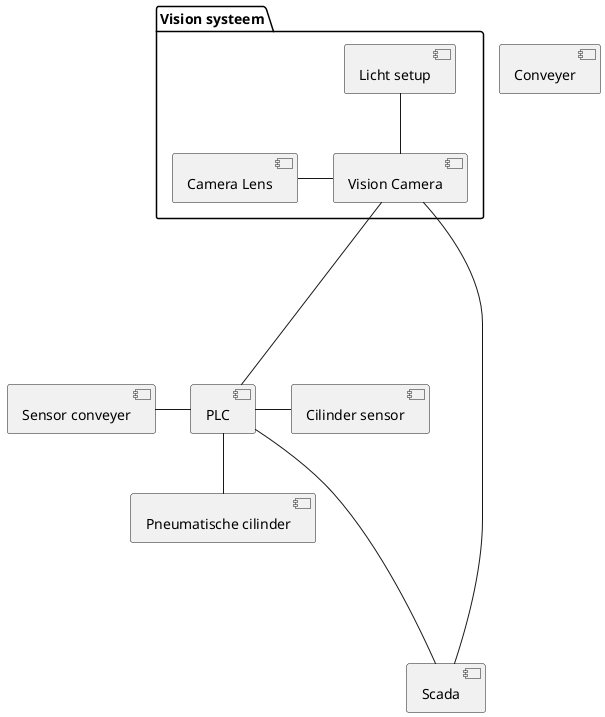

# Component Diagram

```plantuml
@startuml
package "Vision systeem"{
[Camera Lens] - [Vision Camera]
[Licht setup] -- [Vision Camera]
}
[Vision Camera] ---- [PLC]
[PLC] -- [Pneumatische cilinder]
[Vision Camera] -- [Scada]
[PLC] ---- [Scada]
[PLC] - [Cilinder sensor] 
[Conveyer]
[Sensor conveyer] - [PLC]
@enduml
```
---