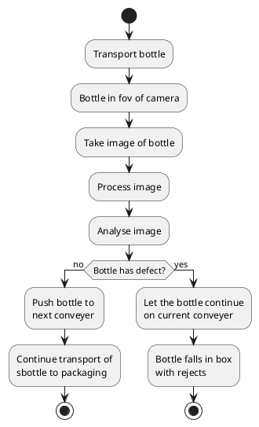

# Chapter 1 - Flowchart Proces

```plantuml
@startuml Proces of Inline Quality Control
Start
:Transport bottle;
:Bottle in fov of camera;
:Take image of bottle;
:Process image;
:Analyse image;
if (Bottle has defect?) then (no)
  :Push bottle to \nnext conveyer;
  :Continue transport of\nsbottle to packaging;
  stop
else (yes)
  :Let the bottle continue\non current conveyer;
  :Bottle falls in box\nwith rejects;
  stop
 


@enduml
```
Commit Rick
