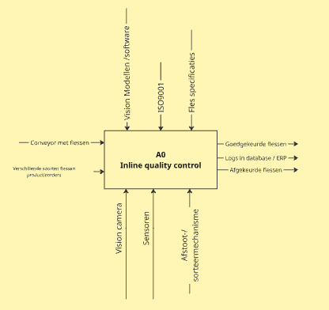
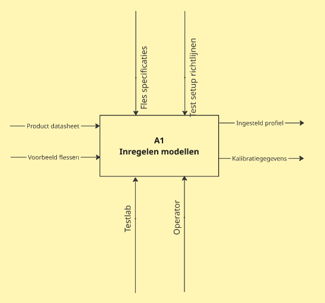

# Project decomposition

This top-level diagram summarizes the entire inline quality control system. It shows how various inputs—like bottle types, vision models, and ISO standards—feed into the central process. The system outputs approved and rejected bottles, with all decisions logged into a database or ERP system.

This diagram shows the setup phase where models are calibrated based on product specifications and test inputs. It integrates data from bottle samples, datasheets, and test guidelines, with contributions from the operator and test lab. The result is a configured profile and calibration data used in later stages.

This flow illustrates the inline inspection process using vision technology.
A2 (Image Acquisition): Captures bottle images using a camera setup influenced by lighting and environmental factors.
A3 (Image Processing): Analyzes the images with trained models and software to determine if bottles meet quality standards.
A4 (Sorting): Uses signals from image analysis to separate good and bad bottles via actuators and sensors, logging all results.

