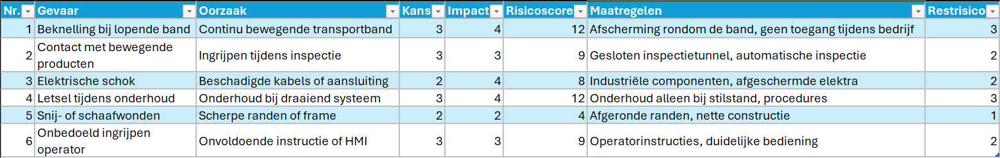

# Risk Assessment – Vision systeem inline quality control

**Schaalverdeling**

**Kans** 
•	1 = komt bijna nooit voor 
•	2 = komt zelden voor 
•	3 = kan voorkomen 
•	4 = komt regelmatig voor 
•	5 = komt zeer vaak voor 

**Impact** 
•	1 = geen of verwaarloosbaar letsel 
•	2 = licht letsel 
•	3 = tijdelijk letsel 
•	4 = ernstig letsel 
•	5 = blijvend letsel of grote schade 

**Risicoscore** 
Risicoscore = Kans × Impact

